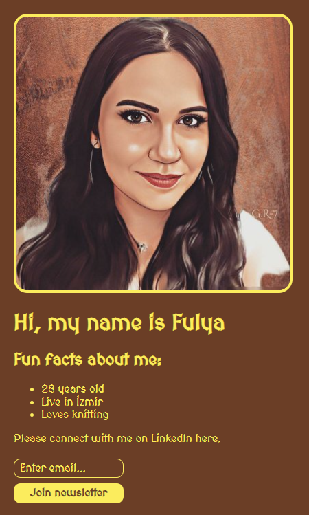
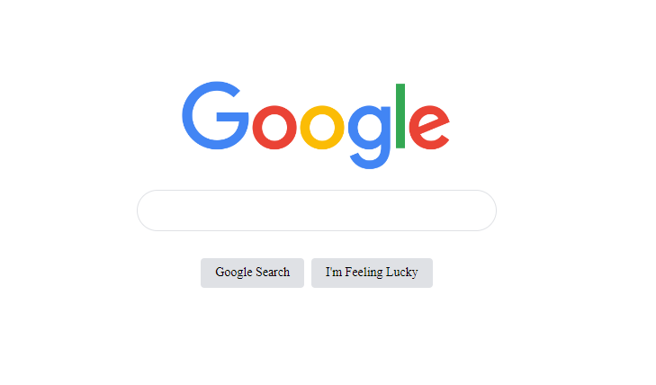
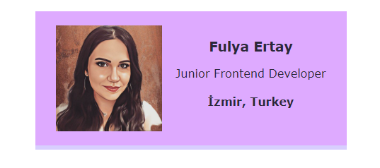
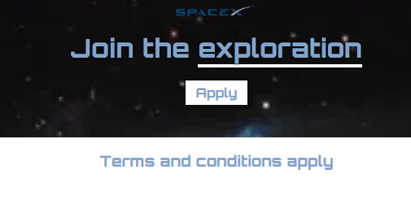
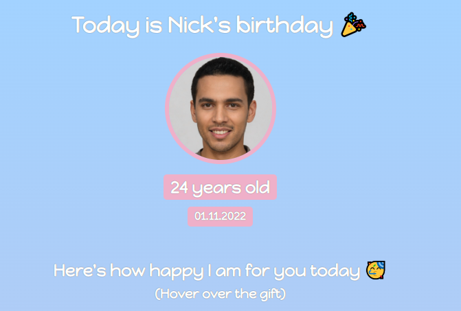

## Table of contents

- [Overview](#overview)
  - [Description](#description)
- [Projects](#projects)
  - [1-Personal Site App](#personal-site)
  - [2-Google Clone App](#google-clone)
  - [3-Business Card App](#business-card)
  - [4-Space Exploration App](#space-exploration)
  - [5-Birthday Gift Site App](#birthday-site)
  
  
  ## Overview
  ### Description
  I completed 4 projects of Module 2 of the frontend developer career path on [Scrimba](https://scrimba.com/learn/htmlandcss). I mastered HTML/CSS in these projects. 
  You can see the visual representations of the each app below.
  
  ## Projects
  ### 1-Personal Site App
  ### Visulation of the App 

    
    
  ### 2-Google Clone App
  ### Visulation of the App 

    
    
  ### 3-Business Card App
  ### Visulation of the App 

    
    
  ### 4-Space Exploration App
  ### Visulation of the App 

    
    
  ### 5-Birthday Gift Site
  ### Visulation of the App 

    
    

